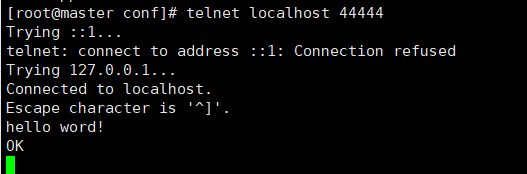
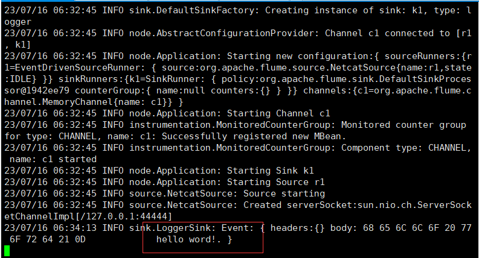

# 首先解压改名，这里不再赘述直接进入下一步

# 修改配置文件
进入flume的conf目录下，复制flume-env.sh.template为flume-env.sh，并修改
```bash
cd /opt/modules/flume/conf
cp flume-env.sh.template flume-env.sh
vi flume-env.sh
```
添加或者修改`JAVA_HOME`路径,若是修改记得取消掉注释
```sh
export JAVA_HOME=/opt/modules/jdk
```

# 添加环境变量
```sh
vi /etc/profile
export FLUME_HOME=/opt/modules/flume
export PATH=$PATH:$FLUME_HOME/bin
```
使用命令`source /etc/profile`使环境变量生效

# 查看是否安装成功

执行命令`flume-ng version`

输出日志如下：
```log
Error: Could not find or load main class org.apache.flume.tools.GetJavaProperty
Flume 1.7.0
Source code repository: https://git-wip-us.apache.org/repos/asf/flume.git
Revision: 511d868555dd4d16e6ce4fedc72c2d1454546707
Compiled by bessbd on Wed Oct 12 20:51:10 CEST 2016
From source with checksum 0d21b3ffdc55a07e1d08875872c00523
```
出现错误
```log
Error: Could not find or load main class org.apache.flume.tools.GetJavaProperty
```
两种解决方法，编辑Hbase的配置文件hbas-env.sh：

1、将hbase的hbase.env.sh的一行配置注释掉
```
#export HBASE_CLASSPATH=/opt/modules/hbase/conf
```
2、或者将HBASE_CLASSPATH改为JAVA_CLASSPATH,配置如下
```
export JAVA_CLASSPATH=.:$JAVA_HOME/lib/dt.jar:$JAVA_HOME/lib/tools.jar
```
我这里使用的是第一种方法

# 进行测试

- 安装测试工具：任选一种

    (1) NetCat

    介绍：netcat是网络工具中的“瑞士军刀”，它能通过TCP和UDP在网络中读写数据。通过与其他工具结合和重定向，你可以在脚本中以多种方式使用它。netcat所做的就是在两台电脑之间建立链接并返回两个数据流。

    安装命令：

    `yum install -y nc`

    (2) Telnet

    介绍：telnet协议是TCP/IP协议族中的一员，是Internet远程登录服务的标准协议和主要方式。它为用户提供了在本地计算机上完成远程主机工作的能力。在终端使用者的电脑上使用telnet程序，用它连接到服务器。终端使用者可以在telnet程序中输入命令，这些命令会在服务器上运行，就像直接在服务器的控制台上输入一样。可以在本地就能控制服务器。

    安装命令：

    `yum install -y telnet`

- 在 flume 的 conf 目录下编写netcat-logger.conf测试文件：

    vi netcat-logger.conf

    将下面内容复制进去
    ```conf
    # 定义这个 agent 中各组件的名字
    a1.sources = r1
    a1.sinks = k1
    a1.channels = c1
    # 描述和配置 source 组件：r1
    a1.sources.r1.type = netcat
    a1.sources.r1.bind = localhost
    a1.sources.r1.port = 44444
    # 描述和配置 sink 组件：k1
    a1.sinks.k1.type = logger
    # 描述和配置 channel 组件，此处使用是内存缓存的方式
    a1.channels.c1.type = memory
    a1.channels.c1.capacity = 1000
    a1.channels.c1.transactionCapacity = 100
    # 描述和配置 source channel sink 之间的连接关系
    a1.sources.r1.channels = c1
    a1.sinks.k1.channel = c1
    ```
    启动flume监听端口的命令:
    ```sh
    flume-ng agent -c conf -f /opt/modules/flume/conf/netcat-logger.conf -n a1 -Dflume.root.logger=INFO,console
    ```
    另外打开一个窗口：

    telnet使用命令：`telnet localhost 44444`进行连接

    netcat使用命令：`nc localhost 44444`进行连接

    在窗口输入数据，客户端会收到相关监听信息

    如下所示：

    发送结果：

    

    接收结果：

    

# 常见错误解决
```log
....
Caused by: java.net.BindException: Address already in use
```
进程运行中，使用`jps`命令查看进程，如下：
```log
2058 Jps
1836 Application
```
使用命令`kill -9 进程ID`   强制结束`Application`进程

如上所示，使用命令`kill -9 1836`结束`Application`进程
