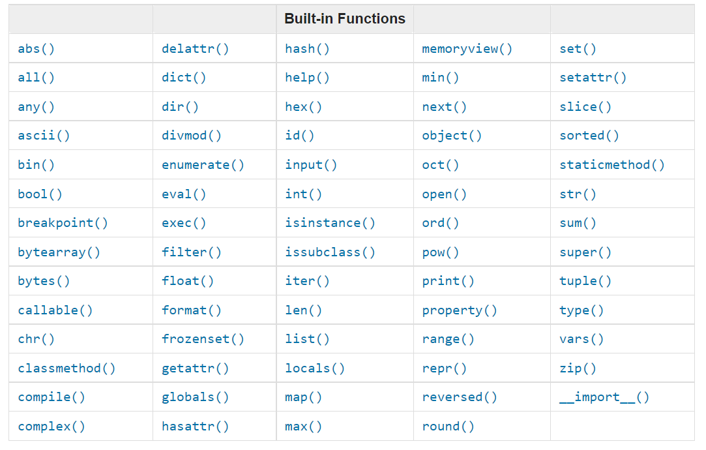

- 📘 第2天
  - [内置方法](#内置方法)
  - 变量
    - [在一行声明多个变量](# 在一行声明多个变量)
  - [数据类型](# 数据类型)
  - [检查数据类型以及转换类型](# 检查数据类型以及转换类型)
  - [数字](# 数字)
  - 💻 习题 - 第2天
    - [习题: 1](# 习题: 1)
    - [习题: 2](# 习题: 2)

# 📘 第2天

## 内置方法

Python有很多内置的方法。内置方法是全局可用的，这意味着你不需要配置和引用旧可以直接使用内置方法。最常用的一些内置方法有：*print()*, *len()*, *type()*, *int()*, *float()*, *str()*, *input()*, *list()*, *dict()*, *min()*, *max()*, *sum()*, *sorted()*, *open()*, *file()*, *help()*, and *dir()*。你可以看到[python 文档](https://gitee.com/link?target=https%3A%2F%2Fdocs.python.org%2F3.9%2Flibrary%2Ffunctions.html)里详尽的内置方法。



```python
print(help('keywords')) #查看python内置关键词
```

Python预置了很多单词。我们不能用预置的单词去声明变量或者方法。在下面的内容我们会讲解变量。

## 变量

变量在计算机的内存中存储数据。便于记忆的变量默认在很多编程语言里面使用。一个便于记忆的变量名称可以容易被想起来和被联想。一个变量涉及到很多用来存储数据的内存地址。 命名变量时不能用数字，特殊字符和中划线。可以用一个字母命名变量（例如 x，y，z），但是更推荐使用一个有意义的单词（firstname， lastname， age， country）。

Python 变量命名规则

- 变量名必须以字母或者下划线开头。
- 变量名不能以数字开头。
- 变量名只能包含数字字母以及下划线 (A-z, 0-9, and _ )
- 变量名大小写敏感 (firstname, Firstname, FirstName and FIRSTNAME) 是不通的变量)

我们看一下合法的变量名

```
firstname
lastname
age
country
city
first_name
last_name
capital_city
_if # 如果我们想用预置的单词作为变量名
year_2021
year2021
current_year_2021
birth_year
num1
num2
```

非法的变量名

```
first-name
first@name
first$name
num-1
1num
```

我们使用被很多Python开发者接纳的标准的Python变量命名格式。Python开发者使用蛇形(snake_case)命名格式。我们在命名多单词变量时，用下划线_连接每个单词（eg. first_name, last_name, engine_rotation_speed）。下面的示例是标准的命名规则，在变量名包含1个以上单词时使用下划线_。

我们给变量赋值时，这个动作叫做声明变量。在下面的例子中，我们给变量first_name赋值了'Asabeneh'。等号“=”是赋值运算符，赋值是指把数据存到变量中。这个等号和数学中的等号意义不同。

*示例:*

```
# Python中的变量
first_name = 'Asabeneh'
last_name = 'Yetayeh'
country = 'Finland'
city = 'Helsinki'
age = 250
is_married = True
skills = ['HTML', 'CSS', 'JS', 'React', 'Python']
person_info = {
   'firstname':'Asabeneh',
   'lastname':'Yetayeh',
   'country':'Finland',
   'city':'Helsinki'
   }
```

我们用一下内置方法print()和len()。打印方法可以接受的参数数量没有限制。参数是可以被方法传递或者引入的值，看一下下面的示例。

**示例:**

```
print('Hello, World!') # 文本 “Hello, World!” 是一个参数
print('Hello',',', 'World','!') # 可以接收多个参数, 传了4个参数
print(len('Hello, World!')) # 这个只接收了1个参数
```

我们打印并且获取上面声明的变量的长度：

**示例:**

```
# 打印存储在变量中的值

print('First name:', first_name)
print('First name length:', len(first_name))
print('Last name: ', last_name)
print('Last name length: ', len(last_name))
print('Country: ', country)
print('City: ', city)
print('Age: ', age)
print('Married: ', is_married)
print('Skills: ', skills)
print('Person information: ', person_info)
```

### 在一行声明多个变量

多个变量可以在一行被声明:

**示例:**

```
first_name, last_name, country, age, is_married = 'Asabeneh', 'Yetayeh', 'Helsink', 250, True

print(first_name, last_name, country, age, is_married)
print('First name:', first_name)
print('Last name: ', last_name)
print('Country: ', country)
print('Age: ', age)
print('Married: ', is_married)
```

获取用户输入的内置方法 *input()* 。把用户输入的内容赋值给first_name和age变量。

**示例:**

```
first_name = input('What is your name: ')
age = input('How old are you? ')

print(first_name)
print(age)
```

## 数据类型

Python中有很多数据类型。通过内置方法 *type* 可以识别数据的类型。请非常用心的去理解不同的数据类型，编程时会经常遇到数据类型的问题。 我一开始就介绍了数据类型，现在又说了一遍，是因为所有章节都与数据类型有关。在相关章节中我们会学习到更具体的内容。

## 检查数据类型以及转换类型

- 检查数据类型: 我们用 *type* 检查某个数据或者变量的数据类型 **示例:**

```
# Python不通的数据类型
# 我们用几个数据类型声明变量

first_name = 'Asabeneh'     # str
last_name = 'Yetayeh'       # str
country = 'Finland'         # str
city= 'Helsinki'            # str
age = 250                   # int，放心，不是我的真实年龄

# 打印出数据类型
print(type('Asabeneh'))     # str
print(type(first_name))     # str
print(type(10))             # int
print(type(3.14))           # float
print(type(1 + 1j))         # complex
print(type(True))           # bool
print(type([1, 2, 3, 4]))     # list
print(type({'name':'Asabeneh','age':250, 'is_married':250}))    # dict
print(type((1,2)))                                              # tuple
print(type(zip([1,2],[3,4])))                                   # set
```

- 转换：从一个数据类型转化为另一个数据类型。在做数学运算时我们会用到 *int()*, *float()*, *str()*, *list*, *set* 首先我们要把其他类型的数据转发为 int 或者 float 不然后报错。 如果我们要把一个数字和字符串连接，要先把数字转换为字符串。 我们会在字符串章节讲到连接。

  **示例:**

```
# int 转为 float
num_int = 10
print('num_int',num_int)         # 10
num_float = float(num_int)
print('num_float:', num_float)   # 10.0

# float 转为 int
gravity = 9.81
print(int(gravity))             # 9

# int 转为 str
num_int = 10
print(num_int)                  # 10
num_str = str(num_int)
print(num_str)                  # '10'

# str 转为 int 或者 float
num_str = '10.6'
print('num_int', int(num_str))      # 10
print('num_float', float(num_str))  # 10.6

# str 转为 list
first_name = 'Asabeneh'
print(first_name)               # 'Asabeneh'
first_name_to_list = list(first_name)
print(first_name_to_list)            # ['A', 's', 'a', 'b', 'e', 'n', 'e', 'h']
```

## 数字

Python的数字数据类型：

1. Integers: 整形(负数, 0 和 正数) 数字 示例: ... -3, -2, -1, 0, 1, 2, 3 ...
2. 浮点型(小数) 示例: ... -3.5, -2.25, -1.0, 0.0, 1.1, 2.2, 3.5 ...
3. 复杂数字 示例: 1 + j, 2 + 4j, 1 - 1j

🌕 很棒！你已经完成了2天的挑战，在通向成功的路上前进了2步。现在来活动一下你的大脑和肌肉吧。

## 💻 习题 - 第2天

### 习题: 1

1. 在 Python30天项目中创建一个 day_2 文件夹，在这个文件夹中创建一个variables.py文件。
2. 写备注 '第2天: Python 30天编程'
3. 声明变量 first name 并赋值
4. 声明变量 last name 并赋值
5. 声明变量 full name 并赋值
6. 声明变量 country variable 并赋值
7. 声明变量 city variable 并赋值
8. 声明变量 age variable 并赋值
9. 声明变量 year variable 并赋值
10. 声明变量 is_married 并赋值
11. 声明变量 is_true 并赋值
12. 声明变量 is_light_on 并赋值
13. 在一行声明多个变量

### 习题: 2

1. 用内置方法 type() 检查所有变量的数据类型
2. 用内置方法 *len()* 检查变量first name的长度
3. 比较 first name 和 last name的长度
4. 声明 num_one 赋值 5 ，声明 num_two 赋值 4
   1. num_one 加 num_two 并赋值给变量 total
   2. num_one 减 num_two 并赋值给变量 diff
   3. num_two 乘以 num_one 并赋值给变量 product
   4. num_one 除以 num_two 并赋值给变量 division
   5. num_two 处以 num_one 取余数并赋值给变量 remainder
   6. 计算num_one的num_two次方 并赋值给变量 exp
   7. num_one 处以 num_two 向下取整屏赋值给 floor_division
5. 圆的半径是 30 米
   1. 计算圆的面积，赋值给 *area_of_circle*
   2. 计算圆的周长，赋值给 *circum_of_circle*
   3. 接收用户输入的值作为半径，并计算面积。
6. 使用内置方法 input 获取用户输入的姓名，国家，年龄并存储在他们对应的变量names中。
7. 在Python终端中执行 help('keywords')查看Python预置的单词。