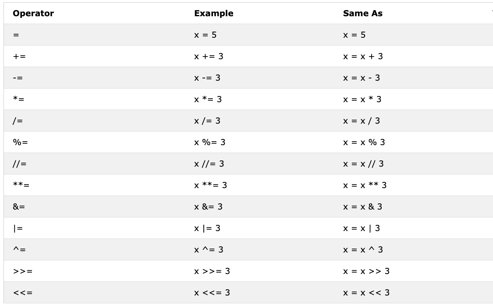

- 📘 第3天
  - [布尔型](#布尔型)
  - 运算符
    - [赋值运算符](#赋值运算符)
    - [算术运算符](#算术运算符)
    - [比较运算符](#比较运算符)
    - [逻辑运算符](#逻辑运算符)
  - [💻习题 - 第3天](#💻 习题 - 第三天)

# 📘 第3天

## 布尔型

布尔数据类型表现为 *True* 或 *False* 其中一个。这些数据类型用法会在我们开始用逻辑运算符后清楚的了解。第一个字母True的 **T** 和False的 **F** 必须是大写，这点跟JaveScript不同。 **示例: 布尔值**

```python
print(True)
print(False)
```

## 运算符

Python语言支持很多运算符。在这个章节，我们聚焦到其中以小部分。

### 赋值运算符

赋值运算符是用来将一个值分配给一个变量。我们已=为例，在数学中，等号是表示2个值想等，但是在Python里表示把一个值存储到一个变量中或者将一个值赋值给一个变量。在下面的表格中显示了不同的python赋值运算符，来源于 [w3school](https://gitee.com/link?target=https%3A%2F%2Fwww.w3schools.com%2Fpython%2Fpython_operators.asp).



### 算术运算符:

- 加法(+): a + b
- 减法(-): a - b
- 乘法(*): a * b
- 除法(/): a / b
- 取余数(%): a % b
- 向下取整除(//): a // b
- 幂运算(**): a ** b


**示例:整型**

```python
# Python中的算术运算符
# Integers

print('Addition: ', 1 + 2)        # 3
print('Subtraction: ', 2 - 1)     # 1
print('Multiplication: ', 2 * 3)  # 6
print ('Division: ', 4 / 2)       # 2.0  Python中的除法返回浮点数
print('Division: ', 6 / 2)        # 3.0         
print('Division: ', 7 / 2)        # 3.5
print('Division without the remainder: ', 7 // 2)   # 3,  返回值不包含小数，不包含余数
print ('Division without the remainder: ',7 // 3)   # 2
print('Modulus: ', 3 % 2)         # 1, 取余数
print('Exponentiation: ', 2 ** 3) # 9 it means 2 * 2 * 2
```

**示例:浮点型**

```python
# Floating numbers
print('Floating Point Number, PI', 3.14)
print('Floating Point Number, gravity', 9.81)
```

**示例:复数**

```python
# Complex numbers
print('Complex number: ', 1 + 1j)
print('Multiplying complex numbers: ',(1 + 1j) * (1 - 1j))
```

我们声明一个变量并赋值一个数字类型的数据。我将用单字母变量名，但是记住，在实际开发中不要习惯声明这种变量。变量名要便于记忆。

**示例:**

```python
# 首先声明变量

a = 3 # a is a variable name and 3 is an integer data type
b = 2 # b is a variable name and 3 is an integer data type

# 计算并且把结果赋值给变量。
total = a + b
diff = a - b
product = a * b
division = a / b
remainder = a % b
floor_division = a // b
exponential = a ** b

# 我应该已经用sum代替total，但是sum是内置方法-尽量避免重写内置方法。
print(total) # 如果你不用字符串标记你打印的内容，你永远不会知道结果是从哪里来的。
print('a + b = ', total)
print('a - b = ', diff)
print('a * b = ', product)
print('a / b = ', division)
print('a % b = ', remainder)
print('a // b = ', floor_division)
print('a ** b = ', exponential)
```

**示例:**

```python
print('== Addition, Subtraction, Multiplication, Division, Modulus ==')

# 声明2个变量然后用于计算
num_one = 3
num_two = 4

# 四则运算
total = num_one + num_two
diff = num_two - num_one
product = num_one * num_two
div = num_two / num_one
remainder = num_two % num_one

# 打印值
print('total: ', total)
print('difference: ', diff)
print('product: ', product)
print('division: ', div)
print('remainder: ', remainder)
```

让我们开始使用已经知道的计算方法和小数点来计算（面积，体积，密度，距离，重量，周长，力）

**示例:**

```python
# 计算圆的面积
radius = 10                                 # 圆的直径
area_of_circle = 3.14 * radius ** 2         # 2个 * 符号表示幂运算
print('Area of a circle:', area_of_circle)

# 计算矩形的面积
length = 10
width = 20
area_of_rectangle = length * width
print('Area of rectangle:', area_of_rectangle)

# 计算物体的重力
mass = 75
gravity = 9.81
weight = mass * gravity
print(weight, 'N')                         # Adding unit to the weight

# Calculate the density of a liquid
mass = 75 # in Kg
volume = 0.075 # in cubic meter
density = mass / volume # 1000 Kg/m^3
```

### 比较运算符

在程序中比较数值休要用到比较运算符。我们检查1个值是否比另一个值大，小，或者相等。下表展示了Python的比较运算符，取自[w3shool](https://gitee.com/link?target=https%3A%2F%2Fwww.w3schools.com%2Fpython%2Fpython_operators.asp).

 **示例：比较运算符**

```python
print(3 > 2)     # True, because 3 is greater than 2
print(3 >= 2)    # True, because 3 is greater than 2
print(3 < 2)     # False,  because 3 is greater than 2
print(2 < 3)     # True, because 2 is less than 3
print(2 <= 3)    # True, because 2 is less than 3
print(3 == 2)    # False, because 3 is not equal to 2
print(3 != 2)    # True, because 3 is not equal to 2
print(len('mango') == len('avocado'))  # False
print(len('mango') != len('avocado'))  # True
print(len('mango') < len('avocado'))   # True
print(len('milk') != len('meat'))      # False
print(len('milk') == len('meat'))      # True
print(len('tomato') == len('potato'))  # True
print(len('python') > len('dragon'))   # False


# 比较2个 True 或 False 的值

print('True == True: ', True == True)
print('True == False: ', True == False)
print('False == False:', False == False)
```

除了上述比较运算符之外，Python还使用：

- *is*: 当2个值相同时返回True(x is y)
- *is not*: 当2个值不同时返回True(x is not y)
- *in*: 当查询的list包含指定的值时返回True(x in y)
- *not in*: 当查询的list不包含指定的值时返回True(x in y)

```python
print('1 is 1', 1 is 1)                   # True - because the data values are the same
print('1 is not 2', 1 is not 2)           # True - because 1 is not 2
print('A in Asabeneh', 'A' in 'Asabeneh') # True - A found in the string
print('B in Asabeneh', 'B' in 'Asabeneh') # False - there is no uppercase B
print('coding' in 'coding for all') # True - because coding for all has the word coding
print('a in an:', 'a' in 'an')      # True
print('4 is 2 ** 2:', 4 is 2 ** 2)   # True
```

### 逻辑运算符

与其他编程语言不同的是，Python使用关键字 *and*, *or* 和 *not* 作为逻辑运算符， 逻辑运算符用于组合条件语句。


```python
print(3 > 2 and 4 > 3) # True - because both statements are true
print(3 > 2 and 4 < 3) # False - because the second statement is false
print(3 < 2 and 4 < 3) # False - because both statements are false
print('True and True: ', True and True)
print(3 > 2 or 4 > 3)  # True - because both statements are true
print(3 > 2 or 4 < 3)  # True - because one of the statements is true
print(3 < 2 or 4 < 3)  # False - because both statements are false
print('True or False:', True or False)
print(not 3 > 2)     # False - because 3 > 2 is true, then not True gives False
print(not True)      # False - Negation, the not operator turns true to false
print(not False)     # True
print(not not True)  # True
print(not not False) # False
```

🌕 你有无限的能量。你刚刚完成了第3天的挑战， 在通向成功的路上前进了3步。现在来活动一下你的大脑和肌肉吧。

## 💻 习题 - 第三天

1. 用整型声明你的年龄。
2. 用浮点型声明你的身高。
3. 声明1个变量用来存放一个复数。
4. 编写1个脚本：提示用户输入三角形的底和高，用于计算得到三角形的面积（area = 0.5 * b * h）。

```
    输入 底: 20
    输入 高: 10
    三角形的面积是： 100
```

1. 编写一个脚本：提示用户输入三角形的3个边 a,b,c。计算得到三角形的周长。 (perimeter = a + b + c)。

```
输入边 a: 5
输入边  b: 4
输入边  c: 3
三角形的周长是： 12
```

1. 获得矩形的长和宽，计算面积(area = length x width)和周长(perimeter = 2 x (length + width))。
2. 获得1个圆的半径，计算面积 (area = pi x r x r) 和周长 (c = 2 x pi x r)，pi=3.14。
3. y = 2x -2，计算斜率，x截距，y截距。
4. 坡度为 (m = y2-y1/x2-x1)。 计算 斜度， 点 (2, 2) 与 点 (6,10)的 [欧几里得度量](https://gitee.com/link?target=https%3A%2F%2Fbaike.baidu.com%2Fitem%2F%E6%AC%A7%E5%87%A0%E9%87%8C%E5%BE%97%E5%BA%A6%E9%87%8F%2F1274107%3Ffr%3Daladdin.)
5. 比较习题8和8的斜度。
6. 计算y的值 (y = x^2 + 6x + 9)。找出当x的值是多少时，y的值变为0。
7. 计算单词的'python' 和 'dragon'长度，然后写一个False的比较条件。
8. 用 *and* 运算符检查 'on' 是否在 'python' 和 'dragon' 中。
9. *I hope this course is not full of jargon*。 用 *in* 运算符检查 单词 *jargon* 是否在句子中。
10. 没有'on'同时在单词 dragon 和 python中。
11. 计算文本 *python* 的长度，然后把值转为浮点型，再转为字符串。
12. 偶数可被2整除，余数为零。如何使用python检查数字是否为偶数？
13. 检查7除3得的值与2.7转整型的值是否相等。
14. 检查 '10' 的类型与 10 的类型是否相同。
15. 检查 int('9.8') 是否与 10 相等。
16. 编写一个脚本：提示用户输入小时数和时薪，计算报酬。

```
输入 小时: 40
输入 时薪: 28
你一周的报酬是:  1120
```

1. 编写一个脚本：提示用户数输入年数，计算一个人可以或多久。 假设人可以活100年。

```
输入你已经活得多少年: 100
你已经活了 3153600000 秒。
```

1. 写一个脚本显示下面的表格

```
1 1 1 1 1
2 1 2 4 8
3 1 3 9 27
4 1 4 16 64
5 1 5 25 125
```